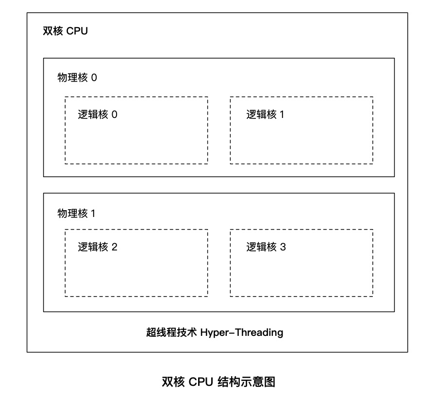
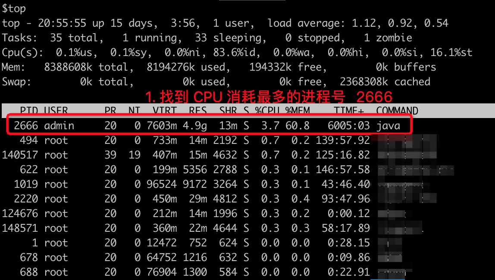
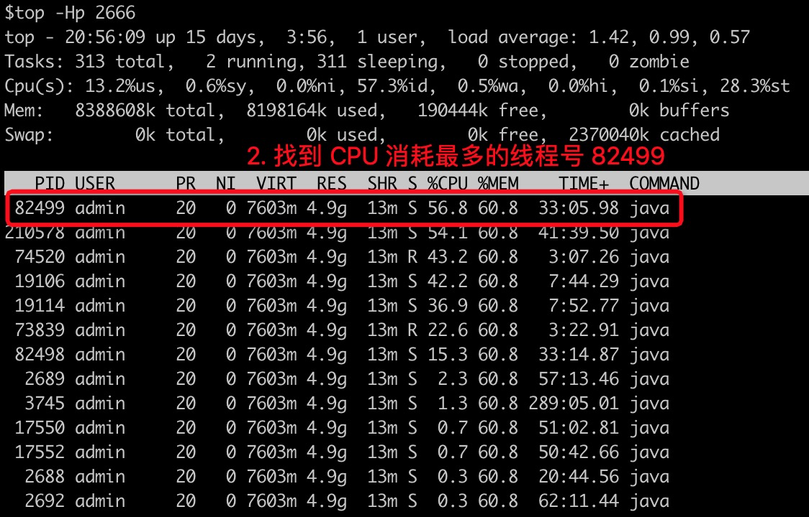
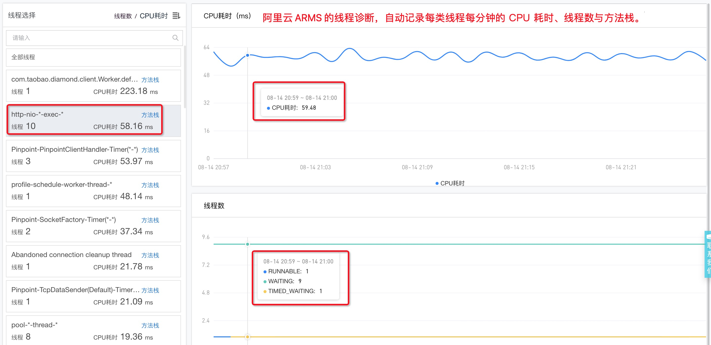
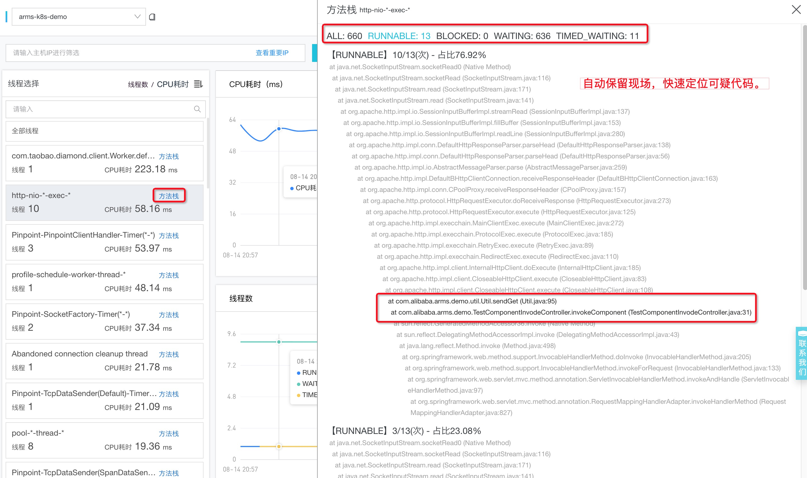

# 系统稳定性——So Hot? 快给 CPU 降降温！

> 作者：夏明（涯海）  
> 创作日期：2019-08-14  
> 专栏地址：[【稳定大于一切】](https://github.com/StabilityMan/StabilityGuide)

CPU（Central Processing Unit）是计算机系统的运算和控制核心，是信息处理、程序运行的最终执行单元，相当于系统的“大脑”。当 CPU 过于繁忙，就像“人脑”并发处理过多的事情，会降低做事的效率，严重时甚至会导致崩溃“宕机”。因此，理解 CPU 的工作原理，合理控制负载，是保障系统稳定持续运行的重要手段。


## 目录
- [CPU 的物理核与逻辑核](#cpu-的物理核与逻辑核)
- [什么是 CPU 使用率？](#什么是-cpu-使用率)
- [什么是平均负载？](#什么是平均负载)
- [CPU 使用率与平均负载的关系](#cpu-使用率与平均负载的关系)
- [性能优化实战](#性能优化实战)
- [推荐工具&产品](#推荐工具产品)
- [参考文章](#参考文章)
- [加入我们](#加入我们)


## CPU 的物理核与逻辑核

一台机器可能包含多块 CPU 芯片，多个 CPU 之间通过系统总线通信。

一块 CPU 芯片可能包含多个物理核，每个物理核都是一个实打实的运算核心（包括运算器、存储器等）。

超线程（Hyper-Threading）技术可以让一个物理核在单位时间内同时处理两个线程，变成两个逻辑核。但它不会拥有传统单核 2 倍的处理能力，也不可能提供完整的并行处理能力。



举个例子，假设一个 CPU 芯片就是一个班级；它有 2 个物理核，也就是 2 个同学，老师让他们分别担任班长和体育委员；过了一段时间，校长要求每个班级还要有学习委员和生活委员，理论上还需要 2 位同学，但是这个班级只有 2 个人，最后老师只能让班长和体育委员兼任。

这样一来，对于不了解的人来说，这个班级有班长、体育委员、学习委员和生活委员 4 个职位，应该有 4 个人，每个职位就是一个逻辑核；但是，实际上这个班级只有 2 位同学，也就是只有 2 个物理核，虽然他们可以做 4 份工作，但是不能把他们当做 4 个人。


### 如何查询 CPU 信息？

在 Linux 系统下，可以从 `/proc/cpuinfo` 文件中读取 CPU 信息，如下图所示：


* 查看 CPU 个数：

```
cat /proc/cpuinfo | grep 'physical id' | sort | uniq | wc -l
```

* 查看 CPU 物理核数：

```
cat /proc/cpuinfo | grep 'cpu cores' | sort | uniq
```

* 查看 CPU 逻辑核数：

```
cat /proc/cpuinfo | grep 'siblings' | sort | uniq
```


## 什么是 CPU 使用率？

CPU 使用率就是 CPU 非空闲态运行的时间占比，它反映了 CPU 的繁忙程度。比如，单核 CPU 1s 内非空闲态运行时间为 0.8s，那么它的 CPU 使用率就是 80%；双核 CPU 1s 内非空闲态运行时间分别为 0.4s 和 0.6s，那么，总体 CPU 使用率就是 `(0.4s + 0.6s) / (1s * 2) = 50%`，其中 2 表示 CPU 核数，多核 CPU 同理。

在 Linux 系统下，使用 top 命令查看 CPU 使用情况，可以得到如下信息：

```
Cpu(s):  0.2%us,  0.1%sy,  0.0%ni, 77.5%id,  2.1%wa,  0.0%hi,  0.0%si, 20.0%st
```

* `us(user)`：表示 CPU 在用户态运行的时间百分比，通常用户态 CPU 高表示有应用程序比较繁忙。典型的用户态程序包括：数据库、Web 服务器等。
* `sy(sys)`：表示 CPU 在内核态运行的时间百分比（不包括中断），通常内核态 CPU 越低越好，否则表示系统存在某些瓶颈。
* `ni(nice)`：表示用 nice 修正进程优先级的用户态进程执行的 CPU 时间。nice 是一个进程优先级的修正值，如果进程通过它修改了优先级，则会单独统计 CPU 开销。
* `id(idle)`：表示 CPU 处于空闲态的时间占比，此时，CPU 会执行一个特定的虚拟进程，名为 System Idle Process。
* `wa(iowait)`：表示 CPU 在等待 I/O 操作完成所花费的时间，通常该指标越低越好，否则表示 I/O 存在瓶颈，可以用 iostat 等命令做进一步分析。
* `hi(hardirq)`：表示 CPU 处理硬中断所花费的时间。硬中断是由外设硬件（如键盘控制器、硬件传感器等）发出的，需要有中断控制器参与，特点是快速执行。
* `si(softirq)`：表示 CPU 处理软中断所花费的时间。软中断是由软件程序（如网络收发、定时调度等）发出的中断信号，特点是延迟执行。
* `st(steal)`：表示 CPU 被其他虚拟机占用的时间，仅出现在多虚拟机场景。如果该指标过高，可以检查下宿主机或其他虚拟机是否异常。


由于 CPU 有多种非空闲态，因此，CPU 使用率计算公式可以总结为：`CPU 使用率 = (1 - 空闲态运行时间/总运行时间) * 100%`。

根据经验法则， **建议生产系统的 CPU 总使用率不要超过 70%。**


## 什么是平均负载？

平均负载（Load Average）是指单位时间内，系统处于 **可运行状态（Running / Runnable）** 和 **不可中断态** 的平均进程数，也就是 **平均活跃进程数。**

可运行态进程包括正在使用 CPU 或者等待 CPU 的进程；不可中断态进程是指处于内核态关键流程中的进程，并且该流程不可被打断。比如当进程向磁盘写数据时，如果被打断，就可能出现磁盘数据与进程数据不一致。 **不可中断态，本质上是系统对进程和硬件设备的一种保护机制。**

在 Linux 系统下，使用 top 命令查看平均负载，可以得到如下信息：

```
load average: 1.09, 1.12, 1.52
```

这 3 个数字分别表示 1分钟、5分钟、15分钟内系统的平均负载。该值越小，表示系统工作量越少，负荷越低；反之负荷越高。


### 平均负载为多少更合理？

理想情况下，每个 CPU 应该满负荷工作，并且没有等待进程，此时，平均负载 = CPU 逻辑核数。

但是，在实际生产系统中，不建议系统满负荷运行。通用的经验法则是：`平均负载 = 0.7 * CPU 逻辑核数`。

* 当平均负载持续大于 0.7 * CPU 逻辑核数，就需要开始调查原因，防止系统恶化；
* 当平均负载持续大于 1.0 * CPU 逻辑核数，必须寻找解决办法，降低平均负载；
* 当平均负载持续大于 5.0 * CPU 逻辑核数，表明系统已出现严重问题，长时间未响应，或者接近死机。

除了关注平均负载值本身，我们也应关注平均负载的变化趋势，这包含两层含义。一是 load1、load5、load15 之间的变化趋势；二是历史的变化趋势。

* 当 load1、load5、load15 三个值非常接近，表明短期内系统负载比较平稳。此时，应该将其与昨天或上周同时段的历史负载进行比对，观察是否有显著上升。
* 当 load1 远小于 load5 或 load15 时，表明系统最近 1 分钟的负载在降低，而过去 5 分钟或 15 分钟的平均负载却很高。
* 当 load1 远大于 load5 或 load15 时，表明系统负载在急剧升高，如果不是临时性抖动，而是持续升高，特别是当 load5 都已超过 `0.7 * CPU 逻辑核数` 时，应调查原因，降低系统负载。


## CPU 使用率与平均负载的关系

CPU 使用率是单位时间内 CPU 繁忙程度的统计。而平均负载不仅包括正在使用 CPU 的进程，还包括等待 CPU 或 I/O 的进程。因此，两者不能等同，有两种常见的场景如下所述：

* CPU 密集型应用，大量进程在等待或使用 CPU，此时 CPU 使用率与平均负载呈正相关状态。
* I/O 密集型应用，大量进程在等待 I/O，此时平均负载会升高，但 CPU 使用率不一定很高。

为了更深入的理解 CPU 使用率与平均负载的关系，我们举一个例子：假设现在有一个电话亭，有 4 个人在等待打电话，电话亭同一时刻只能容纳 1 个人打电话，只有拿起电话筒才算是真正使用。

那么 CPU 使用率就是拿起电话筒的时间占比，它只取决于在电话亭里的人的行为，与平均负载没有非常直接的关系。而平均负载是指在电话亭里的人加上排队的总人数，如下图所示:


## 性能优化实战

无论是 CPU 使用率，还是平均负载，都只是反映系统健康状态的度量指标，而不是问题的根因。因此，它们的价值主要体现在两个方面： **一是综合反映当前系统的健康程度，结合监控告警产品，实现快速响应；二是初步定位问题方向，缩小排查范围，降低故障恢复时间。** 比如当 CPU iowait 高时，应优先排查磁盘 I/O；当 CPU steal 高时，就优先排查宿主机状态。

CPU 涵盖的问题场景有很多，限于篇幅限制，下面以最常见的用户态 CPU 使用率高为例，介绍下 Java 应用的排查思路，其他场景留待后续分享，推荐阅读 [《如何迅速分析出系统CPU的瓶颈在哪里？》](https://time.geekbang.org/column/article/72685)。

### 如何排查用户态 CPU 使用率高？

用户态 CPU 使用率反映了应用程序的繁忙程度，通常与我们自己写的代码息息相关。因此，当你在做应用发布、配置变更或性能优化时，如果想定位消耗 CPU 最多的 Java 代码，可以遵循如下思路：

1. 通过 `top` 命令找到 CPU 消耗最多的进程号；
2. 通过 `top -Hp 进程号` 命令找到 CPU 消耗最多的线程号（列名仍然为 PID）；
3. 通过 `printf "%x\n" 线程号` 命令输出该线程号对应的 16 进制数字；
4. 通过 `jstack 进程号 | grep 16进制线程号  -A 10` 命令找到 CPU 消耗最多的线程方法堆栈。





上述方法是目前业界最常用的诊断流程，如果是非 Java 应用，可以将 jstack 替换为 perf，推荐阅读 [《Perf -- Linux下的系统性能调优工具》](https://www.ibm.com/developerworks/cn/linux/l-cn-perf1/index.html)。

然而，上述方法有两个显著缺陷，一是操作流程复杂，而且往往一次 jstack 还不足以定位根因，需要执行多次；二是只能用于诊断在线问题，如果问题已经发生，无法复现的话，往往只能不了了之。

因此，生产系统推荐使用 APM 产品，比如阿里云的 [ARMS](https://help.aliyun.com/document_detail/63796.html)，可以自动记录每类线程的 CPU 耗时和方法栈，开箱即用，自动保留问题现场，如下图所示:




## 推荐工具&产品
* [阿里云 ARMS 线程诊断](https://help.aliyun.com/document_detail/63796.html)


## 参考文章
* [《Linux性能优化实战》](https://time.geekbang.org/column/intro/140)
* 《CPU问题定位的知识基础与运维基础》
* [《理解Linux系统负荷》](http://www.ruanyifeng.com/blog/2011/07/linux_load_average_explained.html)


## 加入我们
【稳定大于一切】打造国内稳定性领域知识库，**让无法解决的问题少一点点，让世界的确定性多一点点**。

* [GitHub 地址](https://github.com/StabilityMan/StabilityGuide)
* 钉钉群号：23179349
* 如果阅读本文有所收获，欢迎分享给身边的朋友，期待更多同学的加入！


